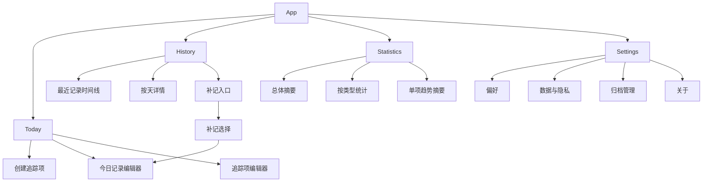

# Marker iOS V1 产品交互稿

> 状态：草稿
> 日期：2026-05-07
> 范围：iOS 首轮试点体验
> 目标：把 `快记`、`低负担`、`可信`、`可回看`、`可扩展` 变成一套可实现、可验证的核心页面交互。

## 1. 产品定位

`Marker iOS V1` 是一个本地优先的个人健康与自我照料记录工具。

它不把用户当成要被督促完成任务的人，而是帮助用户稳定记录与照顾自己有关的持续行为和状态：习惯、用药、经期、自定义备注。

V1 的核心体验目标：

- 用户打开应用后能立刻知道今天需要确认什么。
- 用户能用最少输入完成一次可信记录。
- 用户能改记、补记、删除并理解记录属于哪一天。
- 用户能回看历史，而不是只看到“完成了一次”。
- 用户知道数据当前是本地优先，是否同步、是否备份都不含糊。

## 2. V1 范围

### 2.1 包含

- iOS 四个顶层页：`Today`、`History`、`Statistics`、`Settings`。
- 四类 tracker 的最低可用体验：`习惯`、`用药`、`经期`、`自定义备注`。
- 创建、记录、补记、改记、删除、归档、恢复。
- 基于 payload 的类型化摘要和统计表达。
- 本地优先、同步状态、备份说明等信任感信息。

### 2.2 不包含

- Android 对齐。
- 账号、云同步、多人共享。
- 医疗诊断、用药建议、经期预测结论。
- 复杂提醒调度、小组件、快捷指令。
- 数值型、时长型、范围型 payload。

## 3. 信息架构

顶层导航保持四 Tab：

- `Today`：今天该确认什么、已经记录什么。
- `History`：回看、补记、改记。
- `Statistics`：按类型理解记录节律。
- `Settings`：偏好、归档、数据可信信息。

## 4. 全局交互原则

### 4.1 语言

使用“记录、确认、保存、回看、照料、状态”等词。

避免“冲刺、落后、挑战、不许中断、任务清零”等高压语言。

### 4.2 反馈

每一次写入都必须有明确反馈：

- 保存成功：`已保存`
- 用药保存成功：`今天的用药已确认`
- 删除成功：`记录已删除`，短时间内允许撤销
- 保存失败：说明发生了什么，并保留用户输入

### 4.3 状态解释

界面要区分：

- `有记录`：这一天保存过内容。
- `计入完成`：这条记录是否代表完成。
- `已跳过`：用药已被明确确认为跳过，不等同于未记录。
- `未记录`：今天还没有保存内容。

### 4.4 时间解释

记录详情和编辑页必须展示：

- 记录归属逻辑日：例如 `归属日期：2026-05-07`
- 记录时间：例如 `记录时间：21:14`
- 时区来源：例如 `设备时区：Asia/Shanghai`

默认折叠为一句摘要，点击后展开完整解释。

## 5. 核心页面

## 5.1 Today

### 页面目标

让用户一眼看懂：

- 今天需要确认什么。
- 哪些已经记录。
- 哪些记录需要谨慎处理。

### 页面结构

1. 顶部日期区
2. 今日照料摘要
3. `待确认` 分区
4. `今日已记录` 分区
5. 空状态或轻量提示

### 顶部日期区

内容：

- `今天`
- 当前日期，例如 `5月7日 周四`
- 本地优先状态徽标：`本地保存`

交互：

- 点击日期暂不进入日历，V1 先避免把 Today 变成历史浏览入口。
- 点击 `本地保存` 可弹出简短说明：`当前记录保存在本机。同步暂未启用。`

### 今日照料摘要

推荐文案：

- 有待确认：`今天还有 2 项待确认`
- 全部记录：`今天的记录已保存`
- 无待办：`今天没有需要记录的项目`

不要使用：

- `今日任务 3/5`
- `你还差 2 项`
- `继续保持连胜`

### 待确认分区

展示今天按 schedule 应出现、且尚未产生记录的 tracker。

行样式按类型区分：

#### 习惯行

信息：

- 名称
- 频率摘要
- 可选备注

主操作：

- 圆形勾选按钮
- 点击后快速保存 `.completion`

保存反馈：

- `已记录`

#### 用药行

信息：

- 名称
- 频率摘要
- 如果 tracker notes 有剂量说明，展示为次级文本

主操作：

- `确认` 按钮

点击后打开用药记录表单，而不是一键完成。

原因：

- 用药场景需要区分 `已服用` 与 `已跳过`。
- `已跳过` 是可信记录，不应被误算成完成。

#### 经期行

信息：

- 名称
- 频率摘要或 `按需记录`

主操作：

- `记录状态`

点击后打开经期记录表单。

#### 自定义备注行

信息：

- 名称
- 频率摘要或 `按需记录`

主操作：

- `写记录`

点击后打开备注表单。

### 今日已记录分区

展示今天已经保存过记录的 tracker。

每行必须展示 payload 摘要：

- 习惯：`已完成` 或 `已完成 · 备注`
- 用药：`已服用 · 1 片 · 饭后`
- 用药跳过：`已跳过 · 今天不计入完成`
- 经期：`中量 · 腹痛、疲劳`
- 自定义：备注正文前 1-2 行

主操作：

- `编辑`

点击进入记录编辑器，支持改记和删除。

### Today 空状态

没有任何活跃 tracker：

- 标题：`先记录一件照顾自己的事`
- 描述：`可以从习惯、用药、经期或自定义记录开始。`
- 主操作：`创建追踪项`

有 tracker 但今天都不应记录：

- 标题：`今天很轻松`
- 描述：`今天没有按计划需要确认的项目。`
- 次操作：`查看历史`

## 5.2 创建追踪项

### 页面目标

用户不需要理解底层 `TrackerKind`，只需要选择“想记录什么”。

### 流程

### 第一步：选择类型

以模板入口呈现：

- `习惯`：适合记录持续行为，例如喝水、运动、早睡。
- `用药`：适合确认已服用或已跳过。
- `经期`：适合记录流量、症状和备注。
- `自定义`：适合记录其他状态或观察。

### 第二步：基础信息

通用字段：

- 名称，必填。
- 颜色。
- 备注，可选。

类型化默认值：

- 习惯：默认每日。
- 用药：默认每日，表单中显示剂量和单位提示。
- 经期：默认按需记录，若当前 schedule 还不支持事件型，则先用每日或手动入口过渡。
- 自定义：默认按需记录或每日。

### 第三步：频率

V1 使用现有 schedule 能力：

- 每日
- 每周指定日
- 每周目标次数

校验：

- 名称不能为空。
- 每周指定日不能为空。
- 每周目标次数不能小于 1。

保存成功：

- 回到 Today。
- Toast：`追踪项已创建`

## 5.3 记录编辑器

### 页面目标

让用户确认“这条记录保存了什么、属于哪一天、是否会计入完成”。

### 通用结构

1. 记录对象
2. 类型化内容表单
3. 时间归属说明
4. 保存 / 删除操作

### 记录对象

展示：

- 追踪项名称
- 类型
- 归属日期

如果是补记：

- 标题使用 `补记`
- 显示 `将保存到 2026-05-06`

如果是改记：

- 标题使用 `编辑记录`
- 显示已有记录摘要

### 习惯记录表单

字段：

- 完成状态：默认完成
- 备注，可选

保存后：

- `已保存`

### 用药记录表单

字段：

- 状态：`已服用` / `已跳过`
- 剂量，可选
- 单位，可选
- 备注，可选

状态说明：

- `已服用`：计入完成。
- `已跳过`：保存为记录，但不计入完成。

保存后：

- 已服用：`今天的用药已确认`
- 已跳过：`已保存为跳过`

### 经期记录表单

字段：

- 流量：点滴 / 少量 / 中量 / 大量
- 症状：多选
- 备注，可选

保存后：

- `状态已保存`

### 自定义备注表单

字段：

- 记录内容，必填

保存后：

- `记录已保存`

### 删除

删除前必须确认：

- 标题：`删除这条记录？`
- 描述：`删除后，2026-05-07 的这条记录将不再出现在历史和统计中。`
- 操作：`取消` / `删除`

删除后：

- Toast：`记录已删除`
- 操作：`撤销`

V1 可以先实现短时内存撤销；如果暂不实现恢复，也必须在确认弹窗里如实说明不可撤销。

## 5.4 History

### 页面目标

让用户能回看最近记录、进入某一天明细，并补记漏掉的内容。

### 页面结构

1. 顶部补记入口
2. 类型筛选
3. 最近记录时间线
4. 按天分组

### 最近记录时间线

每条记录显示：

- 追踪项名称
- payload 摘要
- 归属日期
- 记录时间

示例：

- `维生素 D`
- `已服用 · 1 片 · 饭后`
- `5月7日 21:14`

点击进入记录编辑器。

### 按天分组

每天显示：

- 日期
- 记录数量
- 类型摘要，例如 `习惯 2 · 用药 1`

进入日详情后展示当天所有记录。

### 日详情

每条记录显示：

- 名称
- 类型
- payload 摘要
- 记录时间

点击可编辑。

### 补记

入口：

- 顶栏 `plus`
- 空状态中的 `补记一条记录`

流程：

1. 选择日期，不晚于今天。
2. 选择活跃 tracker。
3. 进入对应记录编辑器。
4. 保存后回到对应日期详情或 History 列表。

如果该日期已有同 tracker 记录：

- 进入改记模式。
- 文案：`这一天已有记录，可以直接更新。`

## 5.5 Statistics

### 页面目标

让用户理解自己的记录节律，而不是被完成率施压。

### 页面结构

1. 时间窗口选择：7 天 / 30 天 / 90 天
2. 总体摘要
3. 按类型统计
4. 单项摘要

### 总体摘要

建议指标：

- `累计记录`
- `最近记录天数`
- `活跃追踪项`
- `有记录的日期`

谨慎使用：

- `完成率`
- `连胜`

如果保留完成率，应只用于适合完成语义的 tracker，并改写文案为：

- `习惯完成情况`
- `近 30 天有记录的计划项`

### 习惯统计

展示：

- 近 7/30 天完成情况
- 稳定记录天数
- 单项记录次数

文案：

- `最近 7 天记录较稳定`
- `本周已记录 4 天`

### 用药统计

展示：

- 已服用次数
- 已跳过次数
- 未记录次数

文案：

- `已服用 6 次，已跳过 1 次`
- `跳过会被保存，但不计入服用完成`

### 经期统计

展示：

- 最近记录日期
- 流量分布
- 症状摘要

避免：

- 没有足够数据时做预测。

### 自定义统计

展示：

- 记录次数
- 最近记录
- 高频关键词后置，V1 不做。

## 5.6 Settings

### 页面目标

集中放低频配置、归档、危险操作和信任感说明。

### 页面结构

1. 偏好
2. 数据与隐私
3. 管理
4. 关于

### 偏好

保留：

- 周起始日
- 统计窗口
- 默认首页 tab，后续支持

### 数据与隐私

必须清楚展示：

- `保存方式：本地优先`
- `同步：暂未启用`
- `备份：暂未启用自动备份`

说明文案：

`当前记录保存在这台设备上。删除 App 或更换设备前，请先确认是否已经导出或备份。`

V1 可先提供：

- `了解当前数据状态`

后续再做：

- 导出
- 备份
- 恢复

### 管理

入口：

- 已归档追踪项
- 危险操作后置，不在 Today 暴露

### 关于

展示：

- 应用名
- 版本
- 本地优先状态
- 隐私说明入口

## 5.7 归档管理

### 页面目标

让用户降低 Today 噪音，同时保留历史。

### 行为

归档 tracker 后：

- 不出现在 Today 活跃列表。
- 历史记录保留。
- 统计默认不计入活跃 tracker 数，但历史累计记录仍可读。

恢复 tracker 后：

- 回到 Today 计划判断。
- Toast：`追踪项已恢复`

## 6. 全局状态

### 6.1 加载

启动时优先显示页面骨架或系统默认加载，不使用夸张动效。

### 6.2 空状态

空状态要给下一步，而不是只说明没有数据。

示例：

- Today：`创建追踪项`
- History：`补记一条记录`
- Statistics：`记录几次后，这里会显示趋势`
- Archive：`归档后的追踪项会显示在这里`

### 6.3 错误

错误必须可理解。

通用文案：

- `保存失败，请稍后再试。你的输入还在。`
- `读取记录失败，请重新打开页面。`

### 6.4 成功

成功反馈保持短、稳、明确。

推荐：

- `已保存`
- `记录已删除`
- `追踪项已创建`
- `今天的用药已确认`

## 7. 首轮实现拆分建议

### Change 1：Today 信息架构与记录确认

范围：

- Today 分为 `待确认` 与 `今日已记录`。
- 类型化行内状态。
- 保存成功和失败反馈。

验证：

- 单元测试覆盖 Today item 分类。
- UI test 覆盖习惯快速记录、用药表单记录。

### Change 2：记录改记、删除确认与撤销

范围：

- 记录编辑器区分今日、补记、改记。
- 删除确认文案按 dayKey 展示。
- 删除后撤销。

验证：

- 单元测试覆盖 save 覆盖语义和 delete undo。
- UI test 覆盖 History 进入编辑、删除、撤销。

### Change 3：创建模板化

范围：

- 创建入口先选类型模板。
- 各类型默认字段和频率。
- 表单文案调整。

验证：

- UI test 覆盖四类 tracker 创建。

### Change 4：History 重构

范围：

- 最近记录时间线。
- 按类型筛选。
- 日详情可编辑。

验证：

- 单元测试覆盖 history section 和 type filter。
- UI test 覆盖补记后回看。

### Change 5：Statistics 类型化

范围：

- 移除或弱化泛完成率和连胜。
- 增加按类型摘要。
- 用药跳过不计入服用完成。

验证：

- 单元测试覆盖各 payload 的统计语义。

### Change 6：Settings 信任感

范围：

- 数据与隐私分区。
- 本地优先、同步、备份状态说明。
- 归档管理文案调整。

验证：

- UI smoke 覆盖 Settings 关键信息可见。

## 8. 体验验收清单

- [ ] 用户第一次进入应用时知道该从哪里开始。
- [ ] 用户能在 2 步内完成习惯记录。
- [ ] 用户记录用药时必须能选择已服用或已跳过。
- [ ] 用户能看出已跳过不等于未记录。
- [ ] 用户能补记昨天的内容。
- [ ] 用户能编辑历史记录。
- [ ] 删除记录前有明确确认。
- [ ] 删除后有清楚反馈或恢复路径。
- [ ] History 中展示 payload 摘要。
- [ ] Statistics 不把所有 tracker 都解释成同一种完成率。
- [ ] Settings 清楚说明本地优先、同步和备份状态。
- [ ] 所有空状态都有下一步行动。
- [ ] 所有失败状态都不静默。

## 9. 待决问题

- V1 是否允许经期和自定义 tracker 不依赖 schedule，以纯事件方式出现在 Today 之外？
- 删除撤销是否需要持久化，还是先做短时内存撤销？
- 统计页是否完全移除 `当前连胜`，还是仅改成更温和的 `连续有记录天数`？
- 是否需要在创建用药 tracker 时增加默认剂量字段，还是先只放在每次记录 payload 中？
- 导出入口在 V1 是真实导出能力，还是先做备份状态说明？
